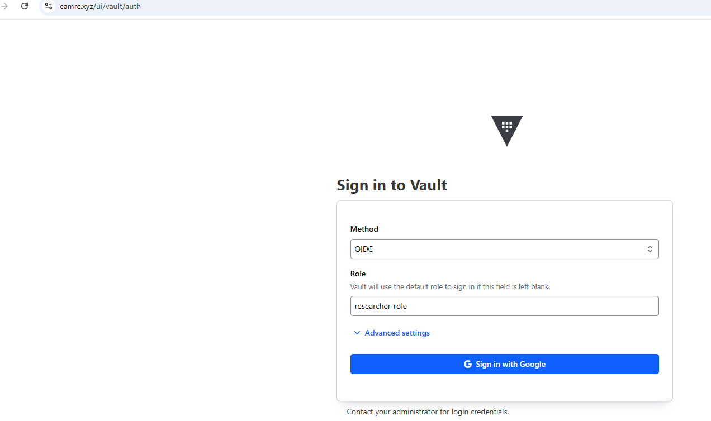

# Automated Encryption of Kubernetes Block Storage

The tasks described below focus on automating the lifecycle of encrypted block storage. It uses a Kubernetes-native operator built with Python Kopf and HashiCorp Vault. It provides on-the-fly LUKS formatting, secure key management, multi-tenant isolation and zero-downtime key rotation.

A CSI driver implementation is now available in the `csi-driver/` directory, deployed via the `luks-csi-driver/` Helm chart. It provides the same Vault-backed LUKS encryption through the standard Kubernetes PVC interface, without requiring custom resources or privileged workload pods. **For new deployments, the CSI driver is the recommended approach.** See [`csi-driver/README.md`](csi-driver/README.md) for full instructions.

# Prerequisites

- Kubernetes cluster
- CSI driver installed
- Block StorageClass configured
- Python 3.11 (development)
- Docker
- kubectl
- Helm

# Project structure

```shell
├── README.md
├── main.py                          # Kopf operator (Python/kopf framework)
├── requirements.txt
├── Dockerfile
├── Dockerfile-storage-tool
├── entrypoint.sh
├── luks-operator-vault/             # Helm chart for kopf operator
│   ├── Chart.yaml
│   ├── values.yaml
│   ├── custom-resource/
│   │   └── encrypted-volume-cr-vault.yaml
│   └── templates/
│       ├── crds/crd.yaml            # EncryptedVolume CRD
│       ├── deployment.yaml
│       ├── rbac.yaml
│       └── registry-secret.yaml
├── vault-values/
│   └── values.yaml                  # Vault HA Helm values
├── scripts/
│   └── k8s-luks-restricted.sh       # AppArmor profile deployment (kopf operator)
├── csi-driver/                      # CSI driver (Python gRPC) — recommended
│   ├── README.md                    # CSI driver documentation
│   ├── SECURITY.md                  # Security review for sensitive data workloads
│   ├── main.py / controller.py / node.py / luks.py / vault.py / k8s.py / driver.py
│   ├── manifests/                   # Raw Kubernetes manifests
│   └── proto/csi.proto
└── luks-csi-driver/                 # Helm chart for CSI driver — recommended
    ├── Chart.yaml
    ├── values.yaml
    └── templates/
        ├── csidriver.yaml / storageclass.yaml / controller.yaml / node.yaml
        ├── rbac.yaml / serviceaccounts.yaml
        └── apparmor-profile.yaml    # AppArmor loader DaemonSet (automatic)
```

# Features

- Automated LUKS Provisioning: Automatically encrypts PVC volumes with LUKS
- Vault Key Management: Integrates with HashiCorp vault using KV-V2 engine for encryption key storage and rotation.
- Key Rotation: Operator monitors vault key version changes using a background timer, which is triggered on version change for rekeying.
- Federated Identity: Configured myAccessID for federated access using institutions's id to manage encrypted volume keys. (Not yet implemented)
- Ephemeral Rekeying: Uses short-lived jobs with restricted AppAmor profiles to perform key rotations.

# Architecture

**Kopf Operator:**

1. CRD Controller: Watches `EncryptedVolume` custom resource.
2. Vault Sync: The Operator kopf timer watches the vault secret version change every 30secs.
3. Annotation Trigger: Operator patches the vaultVersion annotation when a new vault secret version is found.
4. Rekey Job: Annotation change triggers a privileged job (restricted using the Kubernetes AppArmor profile) that does the vault key rotation running `luksAddKey` and `luksRemoveKey` on the worker node.

**CSI Driver (recommended):** The `csi-driver/` implements the same lifecycle via the standard Kubernetes CSI interface. A Controller Deployment provisions backing PVCs and auto-generates Vault LUKS keys at `CreateVolume` time. A Node DaemonSet handles `luksFormat`, `luksOpen`, mount, unmount, and `luksClose` via CSI NodeStage/NodeUnstage RPCs. Key rotation applies automatically in `NodeStageVolume` when the Vault version has advanced. Only the node DaemonSet requires privileged access; user workload pods are unprivileged. The AppArmor profile is deployed automatically via a loader DaemonSet — no SSH to worker nodes required.

# Custom Resource

```yaml
apiVersion: crypto.example.com/v1
kind: EncryptedVolume
metadata:
  name: luks-encrypted-volume-new
  namespace: default
spec:
  institution: "university of cambridge"
  pvcName: "csi-pvc-cinder-for-luks"
  mountPath: "/mnt/securefolder"
  size: "2Gi"
  deletionPolicy: "Delete"
  storageClassName: "cinder-sc"
```

# Installation & Setup

1. Vault Configuration

## Step 1

Install, configure vault via helm chart and create vault policy and role.

```bash
# Install AppAmor profile on the nodes
chmod u+x  scripts/k8s-luks-restricted.sh
./scripts/k8s-luks-restricted.sh


# Vault Setup - Install vault HA
helm install vault hashicorp/vault -f vault-values/values.yaml

# Initialize to prepare vault storage to receive data. Save the 5 Unseal keys and initial root token in a secure location
kubectl exec vault-0 -- vault operator init

#Unseal the leader (vault-0) with the unseal command 3 times using different keys. Do same for vault-1 and vault-2
kubectl exec -it vault-0 -- vault operator unseal

# Join the new nodes as peers to the raft cluster
kubectl exec vault-1 -- vault operator raft join http://vault-0.vault-internal:8200

# Login with the root token provided to setup auth methods
kubectl exec -it vault-0 -- vault login <root token>

#enable vault to trust Kubernetes
kubectl exec vault-0 -- vault auth enable kubernetes

#configure access
kubectl exec vault-0 -- sh -c 'vault write auth/kubernetes/config \
    kubernetes_host="https://$KUBERNETES_SERVICE_HOST:$KUBERNETES_SERVICE_PORT"'

kubectl exec vault-0 -- vault write auth/kubernetes/role/luks-operator-role \
    bound_service_account_names="encrypted-volume-operator" \
    bound_service_account_namespaces="default" \
    policies="luks-policy" \
    ttl="24h"

# policy and role
kubectl exec -i vault-0 -- vault policy write luks-policy - <<EOF
path "secret/data/tenants/*" {
  capabilities = ["create", "read", "update", "delete", "list"]
}

path "secret/metadata/tenants/*" {
  capabilities = ["read", "list", "delete"]
}

path "secret/metadata/tenants" {
  capabilities = ["list"]
}

path "secret/metadata" {
  capabilities = ["list"]
}

path "sys/internal/ui/mounts/secret" {
  capabilities = ["read"]
}

path "identity/entity/id/{{identity.entity.id}}" {
  capabilities = ["read"]
}

path "identity/entity/name/{{identity.entity.name}}" {
  capabilities = ["read"]
}

path "identity/entity/id" {
  capabilities = ["list"]
}
EOF
```

## Step 2

2. Install Kubernetes Operator (kopf)

```bash
# Create and extract secret

kubectl create secret docker-registry <gitlab-regcred-cam> \
  --docker-server=registry.gitlab.developers.cam.ac.uk \
  --docker-username='<user>' \
  --docker-password='<redacted>>' \
  --docker-email='<user@test.com>' \
  -n default

GET_SECRET=$(kubectl get secret gitlab-regcred-cam -n default  -o jsonpath='{.data.\.dockerconfigjson}')

helm install luks-test-vault . --set imageCredentials.docker ConfigJson=$GET_SECRET

# Create Custom resource
kubectl apply -f luks-operator-vault/custom-resource/encrypted-volume-cr-vault.yaml
```

## Alternative: Deploy the CSI Driver (recommended for new deployments)

See [`csi-driver/README.md`](csi-driver/README.md) for full prerequisites and
instructions. The Vault role setup in Step 1 above is shared — the only difference is
that the CSI driver role binds to `luks-csi-controller` and `luks-csi-node` service
accounts in `kube-system` (not `encrypted-volume-operator` in `default`).

```bash
# Build the driver image
docker build -t luks-csi:dev ./csi-driver/

# Deploy via Helm
helm install luks-csi-driver ./luks-csi-driver/ \
  --namespace kube-system \
  --set vault.address="http://vault.default.svc.cluster.local:8200" \
  --set vault.role="luks-operator-role" \
  --set storageClass.backingStorageClass="<your-block-storageclass>" \
  --set storageClass.institution="<your-institution>"
```

## Verification

#### Verify encryption on a worker node

```bash
#find the device
lsblk -o NAME,MAJ:MIN

# output
NAME                             MAJ:MIN
loop0                              7:0
loop1                              7:1
loop2                              7:2
loop3                              7:3
loop4                              7:4
loop5                              7:5
loop7                              7:7
sda                                8:0
├─sda1                             8:1
├─sda14                            8:14
└─sda15                            8:15
sdb                                8:16
└─luks-luks-encrypted-volume-new 253:0

# Test the latest key
echo -n "qqm+V0P2lqQ5CuHY8VsB9w==" | sudo cryptsetup luksOpen --test-passphrase /dev/sdb --key-file - -v

# output
No usable token is available.
Key slot 1 unlocked.
Command successful.

# Test with a wrong key
echo -n "qqm+V0P2lqQ5CuHY8VfB9x==" | sudo cryptsetup luksOpen --test-passphrase /dev/sdb --key-file - -v

# Output
No usable token is available.
No key available with this passphrase.
Command failed with code -2 (no permission or bad passphrase).

# Check LUKS Header slots
sudo cryptsetup luksDump /dev/sdb
```

## Step 3

3. Access Vault UI

Access to the Vault UI can either be via the dev mode or OIDC

Login to vault OIDC `https://<DOMAIN-NAME>/ui/vault/auth` using either Google or MyAccessID (Institution credentials).

To login with OIDC, change method to `OIDC` and role to e.g. `researcher-role` or depending on the name oF the role that is set.

To login to the DEV mode use same URL and change method to `Token` and use the `root token` generated above.


<!--  -->

# Security Considerations

To be able to initialise, format and rekey the underlying block storage, the helper pods (Init-Containers, Rekey jobs) need their privilege access set to `true`. To mitigate this risk associated with escalated privilege, the following are implemented.

- Restricted AppArmor Profiles: Uses custom AppArmor profiles `k8s-luks-restricted` on all the worker nodes. This profile applies least privilege to all the privilege containers effectively restricting its execution scope to cryptsetup and necessary block-device Sys calls.

- In-Memory Key Handling: To prevent sensitive data leakage of encryption keys, Linux Process Substitution, e.g. echo $KEY, is used to pipe keys directly into the cryptsetup binary from memory so that keys do not persist on the container storage and temporary filesystem.

- Node Isolation (Tainting): It is recommended to Taint specific workloads in a Trusted Research Environment (TRE) so that the short-lived pods are only scheduled on dedicated hardware, thereby isolating them from general-purpose researchers' workload.

- Short-Lived Execution: Rekey job operations are dispatched as ephemeral Kubernetes Jobs so that privileged pods do not persist in the namespace after their tasks are complete.

- Privilege scope reduction (CSI driver): The CSI driver confines privileged access to only the node DaemonSet. User workload pods remain unprivileged, which satisfies Pod Security Admission `restricted` or `baseline` profiles. The AppArmor profile is deployed automatically via a loader DaemonSet — no `scripts/k8s-luks-restricted.sh` SSH step required.

See [`csi-driver/SECURITY.md`](csi-driver/SECURITY.md) for a full security review of the CSI driver, including considerations specific to health data and HIPAA/GDPR workloads.

# Useful Links

- https://github.com/nolar/kopf
- https://github.com/kubernetes-client/python/blob/master/kubernetes/README.md
- https://python-hvac.org/en/stable/usage/secrets_engines/kv_v2.html
- https://developer.hashicorp.com/vault/docs/deploy/kubernetes/injector
- https://developer.hashicorp.com/vault/docs/agent-and-proxy/agent/template
- https://developer.hashicorp.com/vault/docs/secrets/identity/oidc-provider
- https://github.com/container-storage-interface/spec — CSI specification
- https://kubernetes-csi.github.io/docs/ — CSI developer documentation
- [`csi-driver/SECURITY.md`](csi-driver/SECURITY.md) — CSI driver security review
